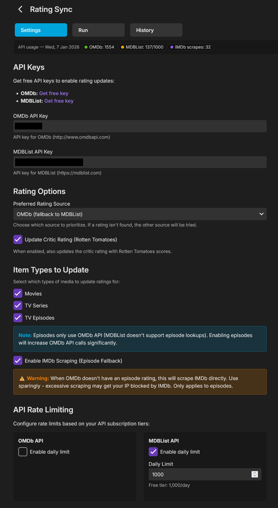
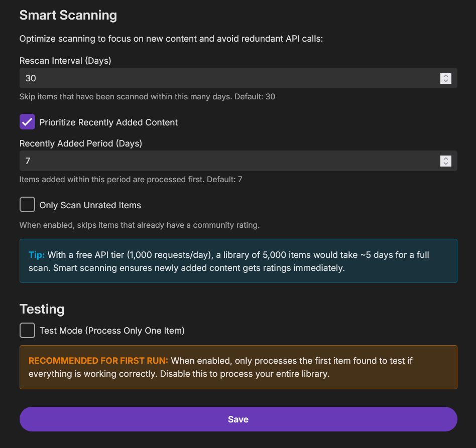
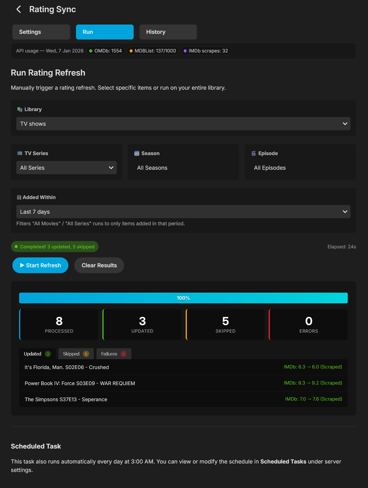
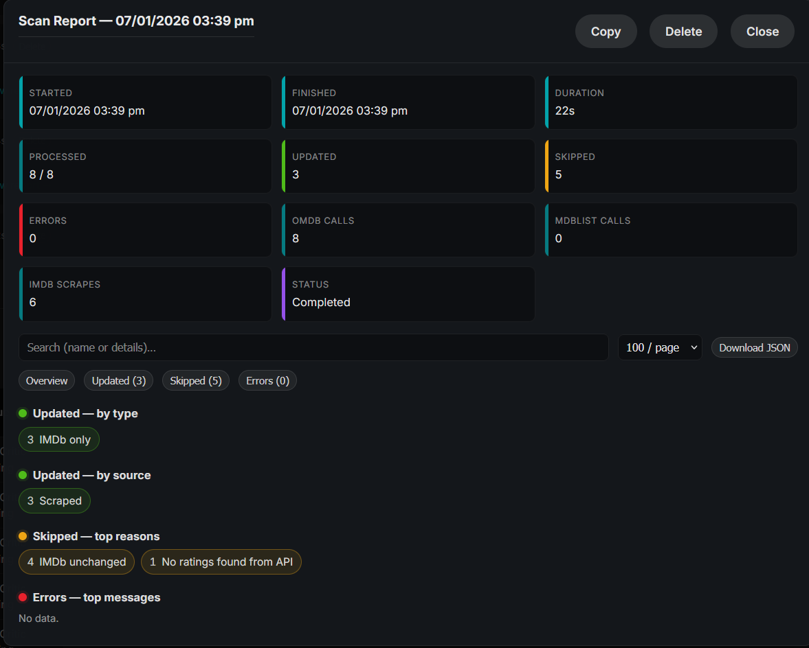
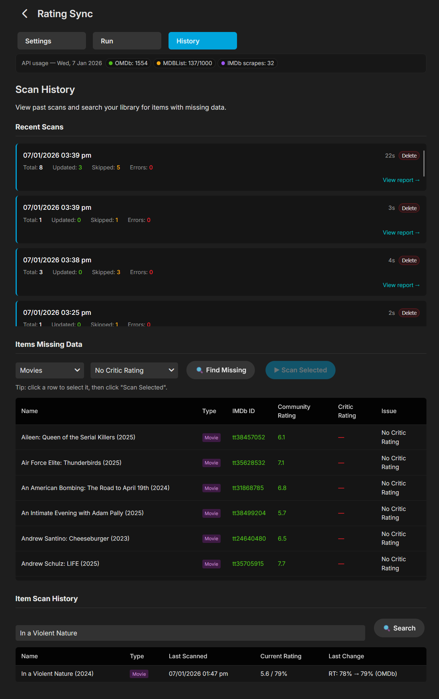

<p align="center">
  
</p>

<h1 align="center">Rating Sync</h1>

<p align="center">
  Emby plugin that syncs IMDb community ratings and Rotten Tomatoes critic ratings into your library metadata.
</p>

<p align="center">
  <a href="#features">Features</a> ·
  <a href="#install">Install</a> ·
  <a href="#quick-start">Quick start</a> ·
  <a href="#screenshots">Screenshots</a> ·
  <a href="https://github.com/pejamas/rating-sync/releases">Download</a>
</p>

<p align="center">
  <a href="https://github.com/pejamas/rating-sync/actions/workflows/ci.yml"></a>
  <a href="https://github.com/pejamas/rating-sync/releases"></a>
  <a href="https://github.com/pejamas/rating-sync/releases"></a>
  <a href="LICENSE"></a>
</p>

## Features

- Update Movies, Series, and optionally Episodes
- Prefer OMDb, MDBList, or both (configurable)
- Optional IMDb ratings fallback using IMDb official free datasets, with a page lookup as secondary
- Rate limiting and daily API limits
- Smart scanning (rescan interval, recently added first, optional skip already-rated)
- Live progress with updated / skipped / error details
- Scan history and per-session reports
- Missing-data search and item-level scan history
- Available from the Emby dashboard sidebar under Server

## Install

1. Download `RatingSync.dll` from the [latest release](https://github.com/pejamas/rating-sync/releases/latest).
2. Copy it into your Emby plugins folder (often `...\Emby-Server\programdata\plugins\`).
3. Restart Emby Server.
4. Open Dashboard > Plugins > Rating Sync, or use Rating Sync in the sidebar.

## Quick start

1. Add an OMDb and/or MDBList API key, or enable IMDb ratings fallback on its own.
2. Choose preferred source and which item types to update.
3. Optionally enable IMDb ratings fallback when primary APIs return no community rating.
4. Open the Run tab and start a refresh (full library or a targeted series / season / episode).

## Rating sources

| Source | What it provides |
| --- | --- |
| OMDb | IMDb community ratings (and related metadata lookups) |
| MDBList | Ratings including Rotten Tomatoes when available |
| IMDb fallback | Official IMDb ratings datasets when APIs have no score |

Episodes use OMDb and/or the IMDb fallback (MDBList does not support episode lookups).

## Screenshots

### Settings

API keys, sources, item types, and rate limits.



### Smart scanning

Control how often items are rescanned and what to prioritize.



### Run

Start a full or targeted refresh and watch progress.



### Scan report

Breakdown of updates, skips, errors, and API usage.



### History

Recent scans, missing data, and per-item history.



PNG files live in [`docs/screenshots/`](docs/screenshots/).

## Build

```powershell
dotnet build -c Release
```

Output: `bin\Release\RatingSync.dll`

### Local Emby assemblies (optional)

If Emby is installed locally, build against its `System` folder:

```powershell
dotnet build -c Release -p:EmbyPath="C:\Program Files\Emby-Server\System"
```

## Releases

Pushing a tag such as `v1.2.3` builds Release, creates a GitHub Release, and uploads `RatingSync.dll` plus a zip.

See [RELEASING.md](RELEASING.md).

## Versioning

[Semantic Versioning](https://semver.org/): `MAJOR.MINOR.PATCH`

- `PATCH`: bug fixes and small changes
- `MINOR`: backwards-compatible features
- `MAJOR`: breaking behavior, config, or API changes
